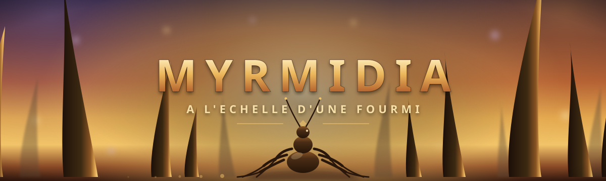

# Myrmidia



MMORPG 3D dans lequel chaque joueur incarne une fourmi de sa colonie, à l'échelle d'un jardin. Inspiré de l'univers de [Formica](https://github.com/blxkourou/formica), avec l'ambition visuelle et systémique d'un WoW ou d'un Dofus.

> Il n'y a pas de héros solitaire sous l'herbe. Il n'y a que des castes, et la colonie qu'elles servent.

Ce dépôt est le point de départ du projet : brainstorming, direction artistique, direction technique et, à terme, le prototype du jeu.

## Univers

Le monde se déroule entièrement à l'échelle d'un jardin : une pelouse devient un continent, une flaque de rosée un lac à traverser en radeau de feuille, un hérisson un raid-boss redouté. Le joueur naît dans l'une de trois super-colonies rivales, chacune avec sa teinte de chitine et son territoire de départ. La progression sert explicitement le collectif : bâtiments débloqués en groupe, castes complémentaires, guerres de territoire à grande échelle.

## Castes jouables

| Caste | Rôle | Identité |
|---|---|---|
| Mandibulaire | Tank | Exosquelette épaissi, provoque par phéromone d'alarme |
| Tisserande | Mage à distance | File la soie en trames offensives et défensives |
| Éclaireuse | Corps-à-corps agile | Furtive, camouflage phéromonal, acide neurotoxique |
| Nourricière | Soigneuse | Soigne par trophallaxie, nourrit les larves du camp |
| Mycologue | Invocatrice | Cultive un champignon parasite type Cordyceps, invoque des hôtes zombifiées |
| Porte-Bannière | Soutien de mêlée | Étendard phéromonal, aura de ralliement |

## Direction technique visée

Le défi central de Myrmidia est géométrique avant d'être artistique : un monde où un brin d'herbe est une tour tenait difficilement debout avant les avancées récentes du rendu temps réel.

- **Moteur** — Unreal Engine 5.x, Nanite pour la géométrie massive (brins d'herbe, grains de terre) sans budget de polygones artisanal, Lumen pour l'éclairage global.
- **Rendu** — PBR stylisé + rim-light, chitine anisotrope, lisibilité en combat avant réalisme photo.
- **Échelle** — Terrain procédural micro-détaillé, jouable jusqu'au brin d'herbe individuel.
- **Animation** — Locomotion hexapode par IK temps réel (solveur FABRIK par patte) plutôt que des cycles clés classiques.
- **Réseau** — Simulation ECS côté serveur (type Unity DOTS / Bevy) avec interest management spatial par région, pour faire vivre des milliers de PNJ indépendamment du nombre de joueurs connectés.

## Direction gameplay visée

- **Combat** — Visée libre avec verrou souple et esquive à i-frames, pas de tab-target.
- **Traversée** — Verticalité omniprésente : grimper les tiges, sauter de feuille en feuille.
- **Exploration** — Mode « Vision-Phéromone » qui révèle pistes de chasse, alertes et messages de guilde déposés dans le monde.
- **Monde vivant** — Météo comme menace réelle (inondation de galeries, prédateurs en événements dynamiques).
- **Progression** — La colonie du joueur continue de fonctionner hors ligne, avec un impact visible au retour.

## Direction artistique

Palette chitine chaude et terreuse plutôt que le vert criard habituel des insectes : `#E0A752` (chitine), `#8FAE5E` (mousse), `#E07356` (rouille), `#E6B558` (miel), `#9DB0D8` (soie), `#C497D9` (spore). Le curseur de style vise un point médian entre le réalisme peint de WoW et les proportions stylisées de Dofus.

Le document complet de brainstorming (esquisses de classes, carte du monde, HUD, arbre de compétences) est dans [`design/concept.html`](design/concept.html).

## Boucle de jeu

L'objectif du joueur est de **faire grandir sa fourmilière** : creuser de nouvelles salles, en agrandir d'anciennes, et faire vivre une colonie de plus en plus nombreuse. Le nid est la mesure du progrès, pas un niveau de personnage.

La partie commence avec le joueur seul, incarnant **la reine** : elle explore, récolte de quoi fonder un nid, creuse sa première salle, puis peut commencer à pondre — chaque ponte fait naître une caste, débloquée progressivement par l'XP de la reine (exploration, combat, découverte). Passé ce prologue, deux échelles de jeu cohabitent, permutables à volonté : le **mode micro** (incarner une fourmi, comme dans le prototype actuel) et le **mode macro** (piloter la fourmilière dans son ensemble — assigner les castes, agrandir le nid, suivre les ressources).

Ce qui alimente la croissance de la colonie :

- **La récolte.** Sortir en surface, rapporter graines, résine, miellat, matériaux. Chaque sortie est un risque : la surface est vaste, éclairée, et peuplée de prédateurs.
- **Les quêtes et la chasse.** Données par la colonie et par ses castes, elles orientent la récolte, ouvrent des territoires, et opposent le joueur à des cibles mobiles plutôt qu'à de la ressource statique.
- **La recherche et la trouvaille.** Certaines salles, techniques et espèces de champignons ne s'achètent pas : elles se découvrent — en explorant, en rapportant un spécimen inconnu, en observant une colonie rivale. C'est le versant curiosité de la progression, en regard du versant travail qu'est la récolte.

La chambre de la reine est le cœur de ce système : c'est d'elle que dépend la population, et donc tout le reste.

Détail complet — mécanisme de ponte, déblocage des castes, articulation micro/macro, première esquisse des sorts de combat par caste — dans [`design/boucle-de-jeu.md`](design/boucle-de-jeu.md).

## État du projet

Phase de brainstorming / pré-production. Un prototype jouable existe (voir `design/prototypes/`) ; rien du jeu lui-même n'est encore codé.

## Structure du dépôt

```
design/     esquisses, direction artistique et documents de concept
```
