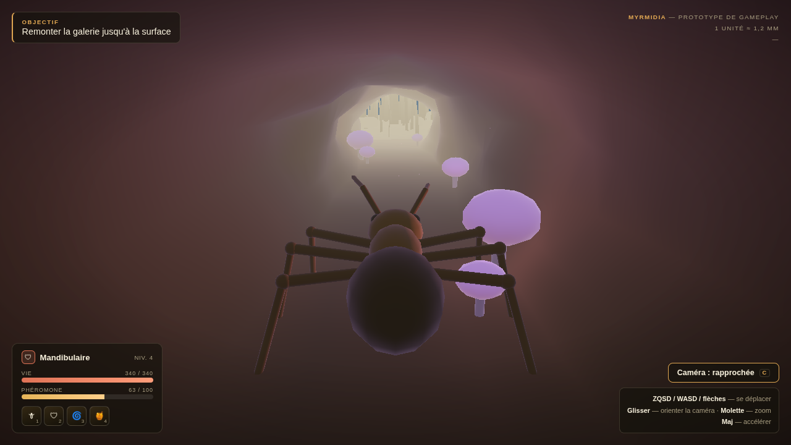
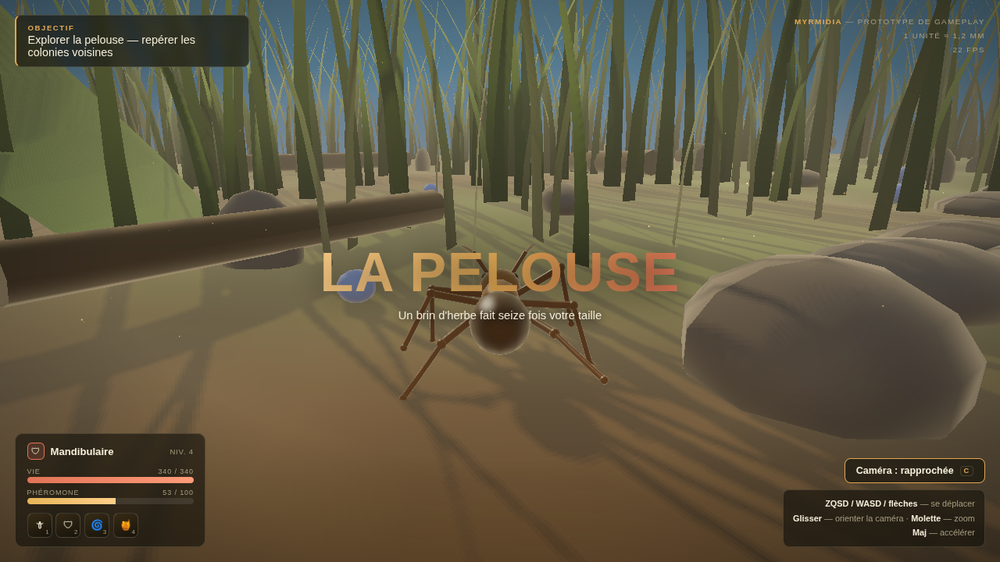
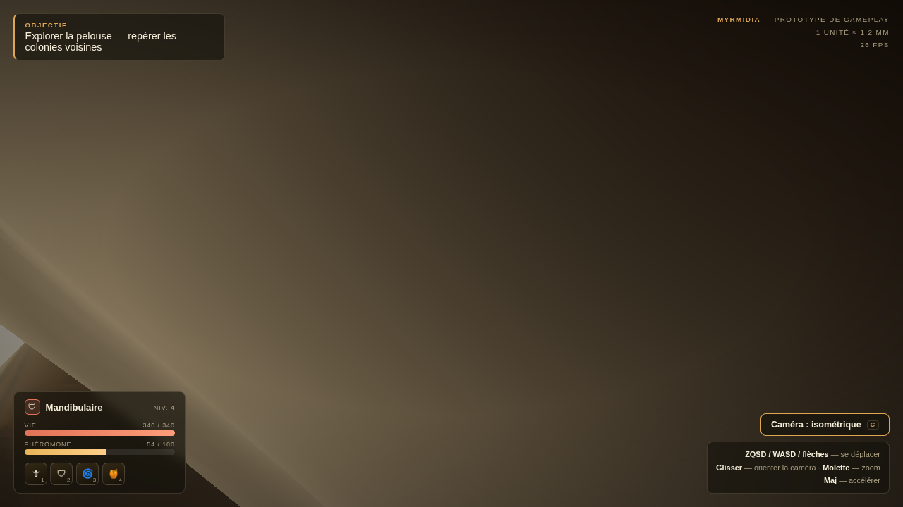

# Prototypes

## `sortie-fourmiliere.html` — Sortie de la Fourmilière

Premier prototype jouable. Une page HTML autonome (WebGL 1, aucune dépendance, aucun build) : ouvrir le fichier dans un navigateur.

**But de ce prototype** : valider les sensations avant de valider l'esthétique. La scène choisie est le passage de l'ombre des galeries à la lumière de la pelouse — le moment qui vend l'échelle du monde d'un seul coup d'œil.

### Commandes

| Entrée | Effet |
|---|---|
| ZQSD / WASD / flèches | Se déplacer (relatif à la caméra) |
| Glisser | Orienter la caméra |
| Molette | Zoom |
| Maj | Accélérer |
| C, ou le bouton | Basculer caméra rapprochée ↔ isométrique |

Sur mobile, glisser sur la moitié gauche fait apparaître un stick virtuel.

### Ce que le prototype met à l'épreuve

- **L'échelle.** 1 unité ≈ 1,2 mm. La fourmi fait ~7 unités, un brin d'herbe 26 à 100 — soit une forêt de tours. C'est le point qui décide si l'univers fonctionne.
- **Les deux caméras.** Rapprochée (façon MMO moderne) contre isométrique fixe (façon Dofus), commutables à chaud pour trancher en la voyant plutôt qu'en en discutant.
- **La locomotion hexapode procédurale.** Les six pattes ne jouent pas de cycle d'animation : chaque pied vise une cible au sol, et le genou est résolu par IK deux os à chaque image, avec une démarche en trépied cadencée sur la distance parcourue (pas de glissement de pied). C'est la version jouet du pilier « animation » du README principal.
- **La transition lumineuse.** Exposition adaptative, brouillard et teinte de contre-jour interpolés entre la galerie et la surface, pour que la sortie se ressente au lieu d'être simplement franchie.
- **L'occlusion caméra.** À hauteur de fourmi, l'herbe passe son temps entre le joueur et sa caméra ; le prototype rapproche la caméra en tenant compte de l'affinement des brins. C'est un vrai problème de conception que ce jeu aura, découvert en jouant.

### Passe artistique

Le rendu se fait en trois passes, toutes écrites à la main en WebGL 1 sans extension obligatoire :

1. **Profondeur vue du soleil** → carte d'ombre 1024², profondeur encodée dans un RGBA8 (aucune extension de texture de profondeur supposée), cadrée sur une boîte orthographique qui suit le joueur. Filtrage PCF 3×3.
2. **La scène**, rendue hors écran. Le vent est appliqué à l'identique dans cette passe et dans la précédente, sinon l'ombre d'un brin ne suivrait pas le brin.
3. **Rayons de lumière**, diffusion radiale depuis la position écran du soleil, composée à l'écran.

Trois détails qui portent l'image bien au-delà de leur coût :

- **Translucidité du feuillage.** Un brin d'herbe est fin : à contre-jour, la lumière le traverse. Un seul terme dans le shader, et la pelouse cesse d'être un décor pour devenir une matière.
- **Brouillard choisi par fragment, pas par caméra.** Depuis la galerie, la pelouse doit *briller* par l'ouverture. Un brouillard indexé sur la position de la caméra noyait la sortie dans la pénombre de la galerie ; l'indexer sur l'exposition propre au fragment transforme l'ouverture en trou de lumière.
- **Spéculaire de chitine.** Un lobe serré appliqué à la seule fourmi, pour qu'elle lise comme une carapace dure au milieu d'un monde mat.

### Ce que le prototype ne fait pas

Pas de combat, pas de grimpe, pas de PNJ, pas de réseau. Le HUD est décoratif (seule la jauge de phéromone bouge, pour donner l'idée).

### Aperçus

### Suite

Grimpe des tiges, combat, PNJ. Une conception alternative sera aussi essayée en parallèle.
