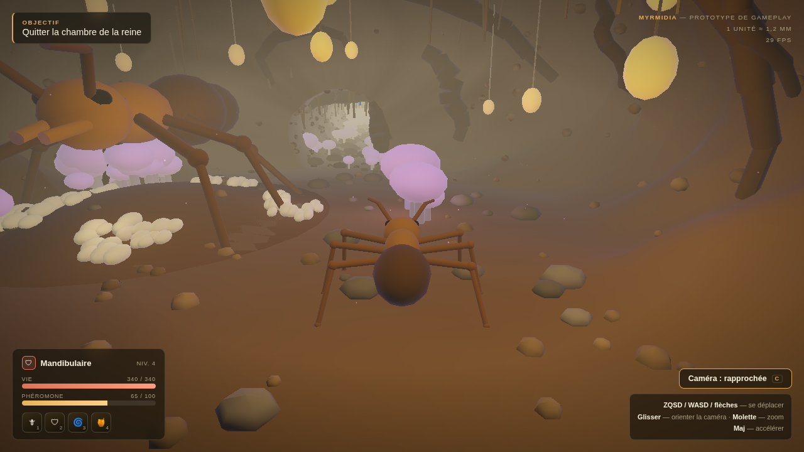
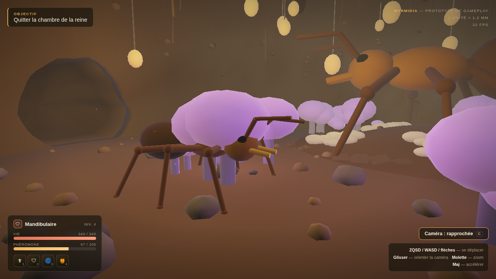

# Prototypes

## `sortie-fourmiliere.html` — Sortie de la Fourmilière

Prototype jouable. Une page HTML autonome (WebGL 1, aucune dépendance, aucun build) : ouvrir le fichier dans un navigateur.

Le joueur commence dans la **chambre de la reine**, traverse la galerie, et débouche sur la pelouse. Trois ambiances enchaînées : le foyer, le passage, puis l'immensité.

### Commandes

| Entrée | Effet |
|---|---|
| ZQSD / WASD / flèches | Se déplacer (relatif à la caméra) |
| Glisser | Orienter la caméra |
| Molette | Zoom |
| Maj | Accélérer |
| C, ou le bouton | Basculer caméra rapprochée ↔ isométrique |
| E | Interagir — grimper à un brin d'herbe, ramasser une ressource, ou redescendre en cours de grimpe |

Sur mobile, glisser sur la moitié gauche fait apparaître un stick virtuel.

### La chambre de la reine

La reine est plusieurs fois la taille d'une ouvrière, posée sur une butte de terre, entourée de son couvain. Elle ne marche pas, mais elle n'est pas un décor : son gastre respire et ses antennes lisent l'air.

Autour d'elle, ce qui rend le lieu habité : des piles d'œufs, des jardins de champignons luminescents, des racines qui traversent le plafond, des radicelles suspendues, des grains de terre pris dans les parois, et des **perles lumineuses** accrochées à des fils — la note fantastique, et la raison pour laquelle la chambre est chaude alors que la galerie est froide.

### Ce que le prototype met à l'épreuve

- **L'échelle.** 1 unité ≈ 1,2 mm. La fourmi fait ~7 unités, un brin d'herbe 26 à 100 — une forêt de tours. La chambre fait 64 unités de large sous 28 de haut : une cathédrale à hauteur d'insecte.
- **Les deux caméras.** Rapprochée (façon MMO moderne) contre isométrique fixe (façon Dofus), commutables à chaud pour trancher en la voyant.
- **La locomotion hexapode procédurale.** Aucun cycle d'animation : chaque pied vise une cible au sol, le genou est résolu par IK deux os à chaque image, démarche en trépied cadencée sur la distance parcourue (donc pas de glissement de pied).
- **La transition lumineuse.** Exposition adaptative, brouillard et contre-jour interpolés entre la galerie et la surface.

### Rendu

Trois passes, écrites à la main en WebGL 1 sans extension obligatoire :

1. **Profondeur vue du soleil** → carte d'ombre 1024², profondeur encodée dans un RGBA8, boîte orthographique qui suit le joueur, filtrage PCF 3×3.
2. **La scène**, hors écran. Le vent est appliqué à l'identique ici et dans la passe d'ombre, sinon l'ombre d'un brin ne suivrait pas le brin.
3. **Rayons de lumière**, diffusion radiale depuis la position écran du soleil.

Détails qui portent l'image bien au-delà de leur coût :

- **Éclairage local, nombreux et petit.** Chaque champignon, chaque perle, chaque pile de couvain porte sa propre lampe ; seules les huit plus proches atteignent le shader. Ce sont les flaques de lumière séparées par du noir qui font qu'un souterrain se lit comme un lieu, et non comme un brouillard brun.
- **Parois creusées, pas tubulaires.** Le rayon de la galerie est bruité sur trois octaves, échantillonné le long d'un cercle pour rester continu au raccord. Les creux gardent leur propre ombre, cuite par sommet : sans ça, une paroi lisse reste illisible quelle que soit la lumière.
- **Translucidité du feuillage.** À contre-jour, la lumière traverse les brins d'herbe.
- **Brouillard choisi par fragment, pas par caméra.** Depuis la galerie, la pelouse doit *briller* par l'ouverture ; un brouillard indexé sur la caméra la noyait dans la pénombre de la galerie.
- **Spéculaire de chitine** sur les seules fourmis, pour qu'elles lisent comme des carapaces dures dans un monde mat.

### Grimpe des tiges

Un brin d'herbe assez grand (au-delà d'une certaine hauteur) peut se grimper : approcher sa base et appuyer sur **E**. La caméra suit, et les six pattes visent la face plate du brin plutôt qu'un sol horizontal — l'échelle du contrôleur hexapode réutilise directement la géométrie déjà construite pour le brin (même courbe que le maillage), sans code de grimpe séparé. Pas de chute ni de vent qui déséquilibre : redescendre se fait aussi par **E**, et ramène instantanément au sol.

### PNJ ouvrières

Quelques ouvrières circulent en boucle dans la galerie et la chambre de la reine (aller-retour entre deux points fixes), avec la même locomotion IK que le joueur. Pas de pathfinding : les points de passage sont choisis à la main pour rester à l'écart des parois et de la reine.

### Amorce de la boucle de jeu

Une fois sur la pelouse, l'objectif affiché passe à la récolte : quelques graines et blocs de résine sont posés sur la pelouse (approcher, **E** pour ramasser), à rapporter dans la galerie. Un petit compteur sous l'objectif garde la trace de ce qui a été rapporté. C'est un premier jet délibérément minimal de la section « Boucle de jeu » du README racine — pas de risque, pas de salle de dépôt dédiée, pas de quêtes distinctes encore.

### Salles supplémentaires

Trois branches se détachent de la galerie principale, chacune une variation de la même technique de tube gonflé bruité que la chambre de la reine : le **grenier** (froid/utilitaire — graines et gouttes de résine), le **couvoir** (chaud/habité — extension directe de la chambre de la reine, densité de lampes-couvain la plus haute du jeu), et le **dépotoir** (froid/dangereux — premier registre lumineux vert-gris malade du jeu, distinct de l'ambre chaud et du violet spore).

### Ce que le prototype ne fait pas

Pas de combat, pas de réseau, pas de son. Pas de chute ni de collision fine sur les brins d'herbe pendant la grimpe. Le HUD reste en grande partie décoratif (jauge de vie, castes, capacités) : seules la phéromone, l'objectif et le compteur de récolte bougent réellement.

### Aperçus

### Suite

Ambiance sonore, une vraie salle de dépôt pour la récolte (le grenier construit s'y prête), des quêtes de colonie distinctes de la récolte libre, chute et vent en grimpe, pathfinding pour les PNJ, et le versant « recherche et trouvaille » du README (champignons et techniques qui se découvrent — le dépotoir est un candidat naturel). Une conception alternative sera aussi essayée en parallèle.
